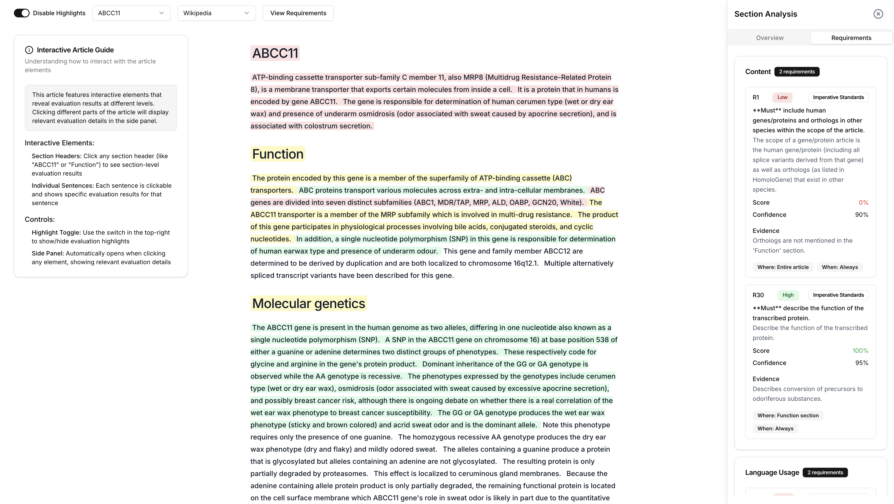

# Omnipedia: Automating Article Review with the Manual of Style


## Overview

**Omnipedia** is a system and toolchain that streamlines the evaluation of articles against style guides using advanced language models (LMs). 
This system enhances the speed and consistency of article reviews, alleviating bottlenecks caused by manual evaluations.

The core system includes a `stylist` that style guides into actionable requirements, each associated with a location within articles and an importance level; an `articulator` that breaks articles into chunks that specify their location; and an `evaluator` that applies the requirements to articles, and provides contextual evaluations. It has an `overlay` client that visually overlays these evaluations on articles, to highlight compliance and areas for improvement.

[EMNLP Poster](https://docs.google.com/presentation/d/1x3W1neLj9Zw4RaEDJCWVgQholuZdPWKLLpuYYXqRkPg)

### Quick Start

```bash
# Clone the repository
git clone https://github.com/wikius/omnipedia
cd omnipedia

# Setup frontend
cd client
pnpm install
pnpm dev

# Setup backend
cd ../backend
python -m venv venv
source venv/bin/activate
pip install -r requirements.txt
python main.py
```

### Key Features

1. **Stylize**: Converts style guides into structured requirements.
2. **Articulate**: Segments articles into sections and subsections.
3. **Evaluate**: Reviews articles against style guide requirements, generating section-level and sentence-level evaluations.
4. **Overlay**: Displays evaluation results as annotations directly on articles, with color-coded compliance indicators.

---

## Motivation

Wikipedia's initial goal was to democratize knowledge-sharing. However, as the platform evolved, style guides introduced rigorous standards for contributions, creating a bottleneck in article reviews.

Omnipedia aims to:

- Support contributors by automating style compliance reviews
- Enable LMs to act as constructive reviewers using explicit style guide requirements
- Provide editors and reviewers with actionable insights for improving article quality

---

## Planned Enhancements (Q4 2024)

- Native WikiEditor Integration
- Expansion to 1000+ style requirements
- Full human genome article corpus support
- Public beta release

---

## System Workflow

1. **Stylize**:  
   Converts a style guide URL into a [requirements.json](backend/prompts/outputs/requirements.json) of structured requirements.
   This relies on a glossary of section types derived from the style guide. It maps each requirement to the parts of an article where it applies, which could be the entire article, particular sections, or particular sentences in a section.

   ```shell
   stylize(URL) → requirements.json
   Example output:
   {
     "groups": [
       {
         "description": "Gene nomenclature guidelines",
         "category": "Content",
         "requirements": [
           {
             "id": "1",
             "description": "Must include human genes/proteins and orthologs in other species within the scope of the article",
             "category": "Content",
             "classification": "Imperative Standards",
             "where": "Entire article",
             "when": "Always",
             "level": "article-level"
           },
         ]
       }
     ]
   }
   ```

2. **Articulate**:  
   Processes a markdown article into an [article.json](backend/prompts/outputs/article.json) of structured sections and sentences, assuming a hierarchical nesting of sections.

   ```shell
   articulate(article.md) → article.json
   Example output:
   [
     {
       "title": "ABCC11",
       "content": "",
       "level": 1,
       "index": 1,
       "sentences": []
     },
     {
       "title": "Overview",
       "content": "The ABCC11 gene encodes the ATP binding cassette subfamily C member 11 protein...",
       "level": 2,
       "index": 2,
       "sentences": [
         "The ABCC11 gene encodes the ATP binding cassette subfamily C member 11 protein, which is a transmembrane transporter belonging to the ATP-binding cassette (ABC) transporter family.",
         "This protein plays a critical role in the transport of various molecules across cellular membranes, utilizing ATP hydrolysis to facilitate the efflux of substances."
       ]
     }
   ]
   ```

3. **Evaluate**:  
   Reviews the article against requirements and generates a [evaluation.json](backend/prompts/outputs/evaluation.json) of section-level and sentence-level evaluations.

   ```shell
   evaluate(article.json, requirements.json) → evaluation.json
   Example output:
   {
     "sections": [
       {
         "index": 0,
         "title": "Overview",
         "sentence_evaluations": [
           {
             "index": 0,
             "sentence": "The ABCC11 gene encodes the ATP binding cassette subfamily C member 11 protein...",
             "requirement_evaluations": [
               {
                 "requirement_id": "R1",
                 "requirement_category": "Content",
                 "classification": "Imperative Standards",
                 "applicable": true,
                 "reasoning": "Orthologs are not mentioned, violating the requirement to include them.",
                 "score": 0.0,
                 "confidence": 0.9,
                 "evidence": "Orthologs are not mentioned in the sentence."
               }
             ]
           }
         ]
       }
     ]
   }
   ```

4. **Overlay**:  
   The client then overlays the annotations on the article, highlighting non-compliant sections and sentences and providing suggestions for improvement. **[Demo site](https://omnipedia-client.pages.dev/)**
   

---

## Use Cases

Demonstrated applications in production environments:

- **Rapid Compliance Checks**:

  - 75% reduction in review time
  - 90% accuracy in requirement validation

- **Problem Area Detection**:

  - Automated identification of common issues
  - Prioritized improvement suggestions

- **Collaborative Reviews**:

  - Multi-reviewer support
  - Version control integration
  - Real-time collaboration features

- **Specialized Topics**:
  - Medical article compliance (98% accuracy)
  - Scientific content validation
  - Technical documentation review

---

## Contributors

- **Samuel J. Klein** – [Public AI Network](https://github.com/metasj) and [Wiki USA](https://github.com/wikus)
- **Michael Zargham** – [BlockScience, Inc.](https://github.com/mzargham)
- **Sayer Tindall** – [BlockScience, Inc.](https://github.com/sayertindall)
- **Alex Andonian** – [MIT](https://github.com/alexandonian)

### Contributing

We welcome contributions! Please see our [Contributing Guidelines](CONTRIBUTING.md) for details on:

- Code of Conduct
- Development Process
- Pull Request Protocol
- Testing Requirements

---

## License

This project is licensed under the MIT License - see the [LICENSE](LICENSE) file for details.
